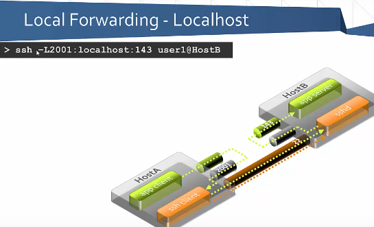
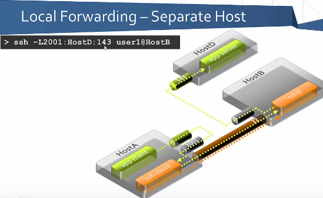
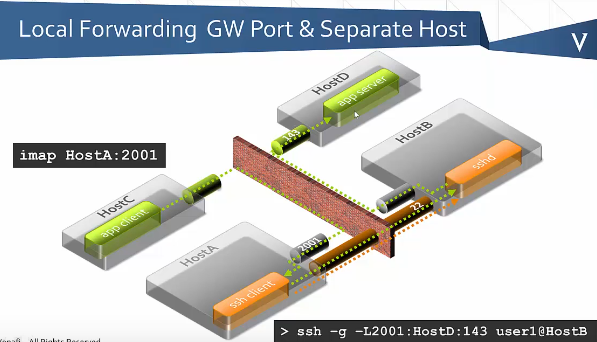
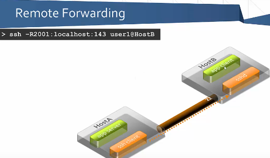

# Pivoting 🔄 ↓↳

### Table of Contents
1. Port Forwarding With SSH
2. Active Directory

### DOOM EMACS - Inline Images
   1. Set the `config.el` as I have it
   2. `Ctrl-C + Tab` to import an image
   3. `Ctrl-C + Ctrl-X + Tab` to make images viewable

---------------------------------------------------------
---------------------------------------------------------

# 1) Port Forwarding With SSH

### Port Forwarding: Table of Conents
* Look at `port_forwardig_screenshots` directory for **screenshots**

   1. Local Port Forwarding 
     + SSH

- - - - - - - - - - - - - - - - - - - - - - - - - -

## 1 - Local Port Forwarding

### SSH 

#### Template 1: Get a Gist

```Get_A_Gist 

Target server <---+    +-----> Target port to 
to which to       |    |      which to forward 
forward traffic   |    |          traffic
                +---+ +-+
                |   | | |
                |   | | |
  ssh -g -L2001:HostD:143 user1@HostB
           |  |           |         |
           +--+           +---------+
            |                   |
            +-->Listening      +---> Autenticate
                 port on              to HostB
                 client               as user1
              (my computer)
```
+ `-g` : Allow remote connections (Gateway Ports)
+ `-L` : Enable local port forwarding


#### Template 2

[Screenshots from this video]: https://www.youtube.com/watch?v=JKrO5WABdoY

1. `ssh -L2001:localhost:143 user1@HostB`  


2. `ssh -L2001:HostD:143 user1@HostB`  



3. `ssh -g -L2001:HostD:143 user1@HostB`  


4. `ssh -R2001:localhost:143 user1@HostB`  



+ Template: `ssh -L <LOCAL_PORT>:`

#### Template 3

+ Example 1: `ssh -L 80:intra.example.com:80 gw.example.com`
 - Opens a connection to the `gw.example.com` jump server
 - Then forwards any connection to port 80 on the local machine to port 80 on 
   `intra.example.com`

By default, anyone (even on different machines) can connect to the specified port on the SSH client machine. However, this can be restricted to programs on the same host by supplying a bind address:

    ssh -L 127.0.0.1:80:intra.example.com:80 gw.example.com

#### Template 4
[From Ippsec - Nibbles Challenge]: https://www.youtube.com/watch?v=s_0GcRGv6Ds&list=PLidcsTyj9JXK-fnabFLVEvHinQ14Jy5tf&index=3

+ Example2:

  `ssh -i ../falafle/root.ky -L9000:10.10.10.75:80 10.10.10.73`
  
 - _My computer_ will listen on the _local port_ of `9000`
 
 - `-i` is when you provide an identity key (private key) for public 
    key autentication
    
 - `10.10.10.75` represents the _target server to forward traffic to_
 
 - `10.10.10.73` is the _target IP that blocked my IP_
 
 - Once there's a hit there, it will send traffic over `ssh`
 - Then _forward_ out of port `80` to the _target IP_

- - - - - - - - - - - - - - - - - - - - - - - - - -

### Other


---------------------------------------------------------
---------------------------------------------------------

# 2) ACTIVE DIRECTORY 


---------------------------------------------------------
---------------------------------------------------------
