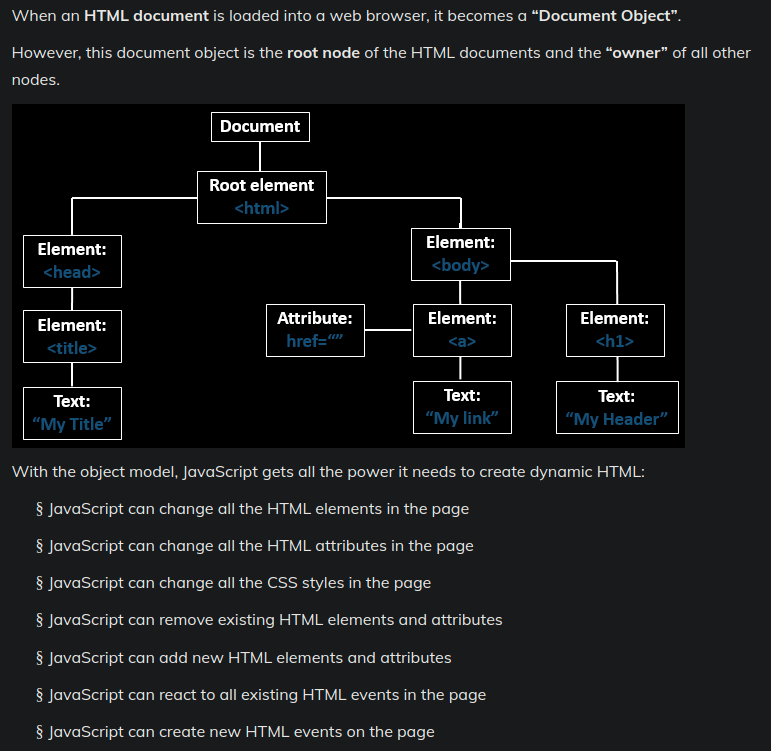

# DOM XSS

[Explaination]: https://owasp.org/www-community/attacks/DOM_Based_XSS
[Sinks]: https://portswigger.net/web-security/cross-site-scripting/dom-based
[Script Gadgets]: /sec/web/xss/Bypassing XSS mitigations via Script gadgets.pdf

[DOM XSS Wiki]: https://github.com/wisec/domxsswiki/wiki

### Table of Contents 
1. Look For Something in HTML that does _dynamic code execution_
  + Tools
2. Most common source (attacker supplied input) is in the _URL_
3. Look for Selectors
4. Access Forms via their name
5. Script Gadgets
6. Some DOM JS Sources
7. Some DOM JS Sinks

`alert(document.cookie)`

**Document Model**



------------------------------------------------------------------------------------

[Search for DOM-Based XSS]: https://www.youtube.com/watch?v=ojiOCfg-FXU

# 1. Look For Something in HTML that does _dynamic code execution_
  + Such as:
   - `eval()`
   - `innerHTML`

##     a) JS Beautify
beautifier.io 
jsnice.org
  
##     b) BURP Tools
  xssValidator: https://www.youtube.com/watch?v=USc9OGGgtT8

##     c) Tools

  XSpear: https://github.com/hahwul/XSpear
  Using XSpear: https://www.youtube.com/watch?v=W4VN1u2lv2U

  ParamSpider -> Gxss -> Dalfox: https://www.youtube.com/watch?v=6rkk3v2a7WQ

  Param Spider: https://github.com/devanshbatham/ParamSpider
  + `python3 paramspider.py -- doman <url> -o ~/Downloads/paramSpider.txt`

  Gxss: https://github.com/KathanP19/Gxss
  + `cat paramSpider.txt | Gxss`
  + `cat paramSpider.txt | Gxss -p user`

  Dalfox: https://github.com/hahwul/dalfox
  Using DalFox: https://www.youtube.com/watch?v=m64aviF1Two
  + `dalfox url <url>`
  + `cat paramSpider.txt | Gxss -p user | dalfox pip --mining-dict /dir/to/params.txt --skip-bav`


------------------------------------------------------------------------------------

# 2. Most common source (attacker supplied input) is in the _URL_
 + such as anything after the `#` symbol like
   `xss-game.com/level3#3' onerror='alert(1)'`

------------------------------------------------------------------------------------

# 3. Look For _Selectors_

+ JavaScript **interacts with the DOM** via so-called _selectors_
  ```Basic_Examples
    <myTag id="someId" class="class1” data-foo="bar"></myTag>
    <script>
     tags = document.querySelectorAll("myTag");           // by tag name
     tags = document.querySelectorAll("#someId");         // by id
     tags = document.querySelectorAll(".class1");         // by class name
     tags = document.querySelectorAll("[data-foo]");      // by attribute name
     tags = document.querySelectorAll("[data-foo^=bar]"); // by attribute value
    </script>
  ```

+ _jQuery_ - Almost every website uses it 
 - **Look for the `$` for jQuerys**
 - Example: `$("<jquery selector>").append("someText_ToAppend");`
 
+ _Bootstrap Framework_ - `data-attributes` API
 - Example: <div data-toggle=tooltip title='I am a tooltip!'>some text</div>

------------------------------------------------------------------------------------

# 4. Access Forms via their name

<div id=a></div>
<form name=querySelector></form>
<script>
  var a = document.querySelector('#a');
  a.innerHTML = 'test';
</script>

------------------------------------------------------------------------------------

# 5. Script Gadgets

[LiveOverflow]: https://www.youtube.com/watch?v=aCexqB9qi70

[Script Gadgets]: /sec/web/xss/Bypassing XSS mitigations via Script gadgets.pdf
[BlackHat]: https://www.youtube.com/watch?v=i6Ug8O23DMU
[OWASP EU Video]: https://www.youtube.com/watch?v=p07acPBi-qw&list=PLpr-xdpM8wG8RHOguwOZhUHkKiDeWpvFp&index=4
+ OWASP video has chapters

  * Piece of _legitimate JavaScript code_ that can be triggered via an _HTML injection_
  * Some gadgets pass the code to `eval()`
  * No `<script>`, `onerror`, etc. is necessary


**Things to look for**

+ `document.querySelectorAll()`
+ `$("<jquery selector>").append("someText_ToAppend");`

```Example-Gadgets
 + document.querySelector(),         | document.getElementById(), …
 + eval(),                           | .innerHTML = foo, …
 + document.createElement(‘script’), | document.createElement(foo)
 + obj[foo] = bar,                   | foo = foo[bar]
 + function(),                       | callback.apply(), ...
```


- - - - - - - - - - - - - - - - - - - - - - - - - - - -

* Script Gadgets _convert otherwise safe HTML tags and attributes into arbitrary JS code execution_
 + Example:
   data-text="&lt;script&gt;"    --BECOMES-->    <script>
 
 
**Example**

  <div data-role="button" data-text="&lt;script&gt;alert(1)&lt;/script&gt;"></div>
                  ^
                  |
                  |
```Selectors-XSS-Example
  <script>
   var buttons = $("[data-role=button]");
   buttons.attr("style", "...");
   // [...]
   buttons.html(button.getAttribute("data-text")); // <--- Script Gadget HERE!!!
  </script>
```
                  |
                  |
                  v
  <div data-role="button" data-text="<script>alert(1)</script>"></div>
                                      ^---- some sanitizers don't touch data attributes
  
------------------------------------------------------------------------------------

# 6. Some DOM JS Sinks

[Wiki for Sources]: https://github.com/wisec/domxsswiki/wiki/sources
[Portswigger Sinks]: https://portswigger.net/web-security/cross-site-scripting/dom-based
    
```Potential_Sources
    document.URL
    document.documentURI
    document.cookie
    document.URLUnencoded (IE 5.5 or later Only)
    document.baseURI
    location
    location.href
    location.search
    location.hash
    location.pathname
    window.localStorage     <-- might contain session tokens
    window.document.cookie
```

------------------------------------------------------------------------------------

# 7. Some DOM JS Sinks

[Wiki for Sinks]: https://github.com/wisec/domxsswiki/wiki/Sinks

```Common_Sinks
document.write()  | document.writeln() |                            |
document.domain   |                    |                            |
element.innerHTML | element.outerHTML  | element.insertAdjacentHTML | element.onevent
postMessage()
```
```jQuery_Sinks
add()             |   after()         | append()  | animate()
before()          |                   |           |
insertAfter()     |  insertBefore()   |           |
html()            |                   |           |
prepend()         |                   |           |
replaceAll()      | replaceWith()     |           |
wrap()            | wrapInner()       | wrapAll() |
has()             |                   |           |
constructor()     |                   |           |
init()            | index()           |           |
jQuery.parseHTML()|                   |           |
$.parseHTML()     |                   |           |
```

```Custom_Per_App
getObjectByName()
getObjectBy<user_controlled_input>()
```

